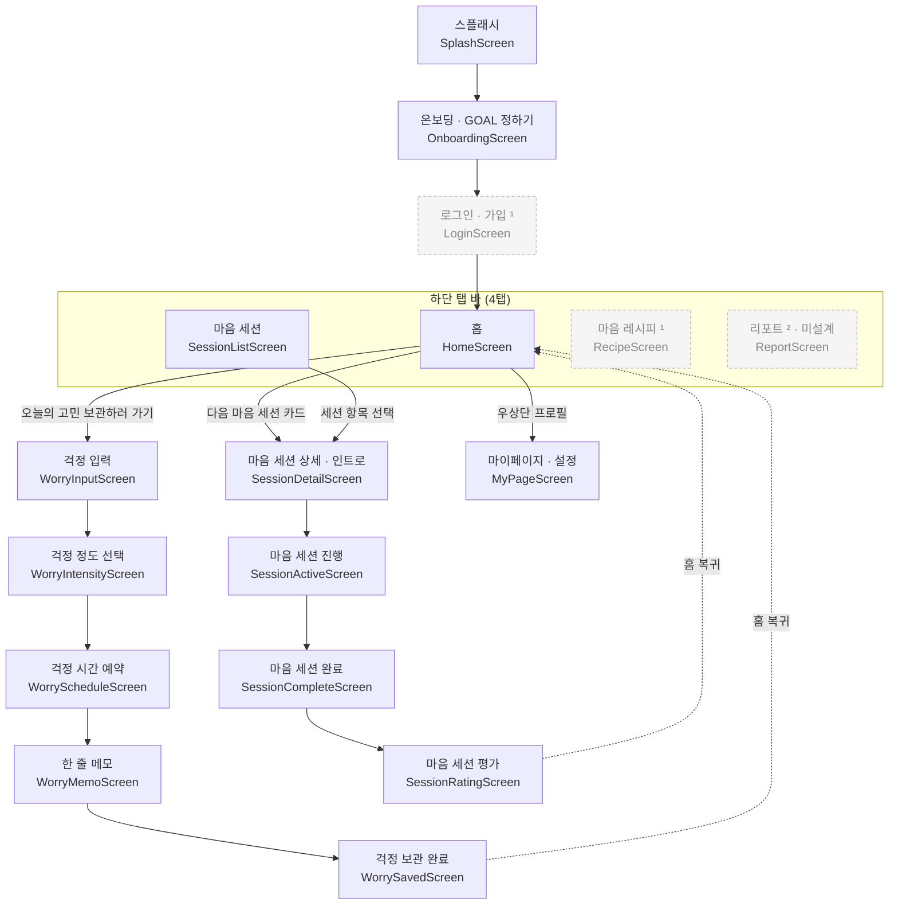

# 고민이따

팀 공용 안드로이드 레포 기반(scaffold) — Kotlin + Jetpack Compose.

## 기술 스택

| 레이어 | 선택 |
|---|---|
| 언어 | Kotlin 2.2.10 |
| UI | Jetpack Compose (Material 3) |
| DI | Hilt 2.59.2 |
| 네비게이션 | Navigation-Compose 2.9.0 |
| 빌드 | AGP 9.1.1 + Gradle 9.4.1 |
| 애노테이션 처리 | KSP 2.2.10-2.0.2 |
| SDK | compileSdk/targetSdk 37, minSdk 26 |

> ⚠️ AGP 는 **9.1.x 를 넘기지 마세요.** Android Studio Panda 2 의 상한이 AGP 9.1 이라, 넘기면 Panda 2 에서 Sync 가 안 됩니다(Panda 4 는 9.2 까지 가능).

---

## 폴더 구조

경량 **클린 아키텍처**(단일 `:app` 모듈, 패키지 기반). 의존 방향: **presentation → domain ← data**.

```
app/src/main/java/com/gominitta/android/
├── GominittaApplication.kt    # @HiltAndroidApp — Hilt 진입점
├── MainActivity.kt             # @AndroidEntryPoint — 단일 액티비티 셸; GominittaTheme + AppNavHost 호스팅
│
│  # ── 레이어: presentation → domain ← data ──
├── domain/                     # 순수 Kotlin (Android/데이터 의존성 X) — 앱의 핵심
│   ├── model/                  #   도메인 모델 (Greeting.kt)
│   ├── repository/             #   Repository 인터페이스 (SampleRepository.kt) — 계약은 domain 이 소유
│   └── usecase/                #   UseCase (GetGreetingUseCase.kt) — 애플리케이션 로직 1단위
├── data/
│   └── repository/             #   Repository 구현 (FakeSampleRepository.kt) — domain 인터페이스 구현
│                               #   (추후: remote/·local/ 데이터소스, mapper/ DTO↔모델)
├── presentation/               # UI + 상태 (기능별 패키지, 화면 17개 스텁)
│   ├── onboarding/             #   Splash · Onboarding · Login
│   ├── home/                   #   HomeScreen + HomeViewModel(@HiltViewModel, UseCase 주입)
│   ├── worry/                  #   걱정 예약 5단계 (Input→Intensity→Schedule→Memo→Saved)
│   ├── session/                #   마음 세션 (List·Detail·Active·Complete·Rating)
│   ├── recipe/                 #   마음 레시피
│   ├── report/                 #   리포트
│   └── mypage/                 #   마이페이지 · 설정
│
├── di/                         # Hilt 모듈 (AppModule.kt: domain 인터페이스 → data 구현 바인딩)
├── navigation/
│   ├── Routes.kt               # 모든 라우트 문자열이 여기에 모임 (얇은 라우트 API)
│   └── AppNavHost.kt           # NavHost — NavController 를 소유하는 유일한 파일
└── ui/                         # 디자인 시스템 (레이어 공통)
    ├── theme/
    │   ├── Color.kt            # 디자인 토큰: 색상 (Figma 값 반영됨)
    │   ├── Type.kt             # 디자인 토큰: 타이포그래피 (Pretendard)
    │   ├── Spacing.kt          # 디자인 토큰: 4dp 그리드 스페이싱
    │   ├── Shape.kt            # 디자인 토큰: 코너 라운드
    │   └── Theme.kt            # GominittaTheme — 모든 토큰을 MaterialTheme 에 연결
    └── components/             # 공용 Composable 컴포넌트 (Gominitta* 래퍼)
```

---

## 아키텍처 개요

런타임에 레이어가 어떻게 연결되는지:

```
GominittaApplication (@HiltAndroidApp)
  └── MainActivity (@AndroidEntryPoint)
        └── GominittaTheme            ← 모든 하위 composable 에 디자인 토큰 적용
              └── AppNavHost           ← NavController 소유; Routes.* → 17개 화면 매핑
                    └── HomeScreen (presentation)  ← 화면은 () -> Unit 네비 콜백만 받음
                          └── HomeViewModel (@HiltViewModel)
                                └── GetGreetingUseCase (domain)
                                      └── SampleRepository (domain 인터페이스)
                                            └── FakeSampleRepository (data)  ← AppModule 의 @Binds
```

나머지 화면도 동일 패턴 — 데이터가 필요한 화면은 `<Screen>ViewModel` + UseCase 를 추가하고, 단순 화면은 콜백만 받는 Composable 로 둡니다.

의존성 역전에 주목: `presentation` 과 `data` 는 둘 다 `domain` 을 향하고, `domain` 은 어느 쪽도 모릅니다.

지켜야 할 핵심 불변식:
- **의존 방향은 `presentation → domain ← data`** — `domain` 은 순수 Kotlin, **Android/데이터 레이어 import 금지**.
- **ViewModel 은 UseCase(도메인)를 주입받는다** — Repository나 구현체를 직접 참조하지 않음.
- **Repository 인터페이스는 `domain` 이 소유**하고 `data` 가 구현한다 (실제 구현 교체 시 domain·presentation 무변경).
- **`AppNavHost.kt` 만 `NavController` 참조를 가진다** — 화면은 절대 import 하지 않음.
- **모든 composable 은 시각 속성을 `MaterialTheme.*` 로 접근한다** — 하드코딩 금지.

---

## 화면 목록 & 네비게이션 플로우

Figma("고민이따", `Design 1차 작업` 페이지 기준, `Design 최종(작업중)` 교차 확인)에서 도출한 화면 목록입니다.
아래 17개 화면은 현재 `presentation/` 에 **스텁 + `Routes` 상수 + `AppNavHost` 배선까지 생성**되어 있습니다(클릭하면 화면 이동이 동작하는 뼈대, UI 속은 미구현) — 각 화면 파일의 내용만 채우면 됩니다.
**앱 컨셉:** 지금 든 걱정을 적고 강도를 정해 **나중 시간에 처리하도록 "예약"** → 그 시간에 **마음 세션**으로 걱정을 다시 마주하고 감정을 기록. 고양이 마스코트가 안내. ("고민 있다 → 고민 이따(가)")

> 구조 규칙: 각 화면은 `presentation/<feature>/<ScreenId>.kt`, 라우트는 `Routes.kt` 상수(`const val HOME = "home"` 식), 화면 간 이동은 `AppNavHost.kt` 에서 배선. `담당자` 열은 팀에서 화면별로 덧붙이세요.

### 온보딩 · 인증

| 화면 이름 | 스크린 ID | 용도 | 진입 경로 |
|---|---|---|---|
| 스플래시 | `SplashScreen` | 로고 + 고양이 마스코트 | 앱 최초 진입 |
| 온보딩(GOAL 정하기) | `OnboardingScreen` | 신규 사용자 목표 설정 체크리스트 | 스플래시 후 (최초 1회) |
| 로그인 / 가입 ¹ | `LoginScreen` | 계정 진입 | 온보딩 후 |

### 메인 — 하단 탭 바 (4탭)

| 화면 이름 | 스크린 ID | 용도 | 진입 경로 |
|---|---|---|---|
| 홈 | `HomeScreen` | 인사말 + "오늘의 고민 보관하러 가기" · "다음 마음 세션" 카드 + 오늘의 한마디 | 로그인 후 / 하단탭: 홈 |
| 마음 세션 | `SessionListScreen` | 예정 · 지난 세션 목록 | 하단탭: 마음 세션 |
| 마음 레시피 ¹ | `RecipeScreen` | 마음 관리 콘텐츠 / 팁 라이브러리 | 하단탭: 마음 레시피 |
| 리포트 ² | `ReportScreen` | 고민 · 감정 통계 그래프 | 하단탭: 리포트 |
| 마이페이지 / 설정 | `MyPageScreen` | 프로필 · 설정 · 리워드 | 홈 우상단 프로필 아이콘 |

### 걱정 예약 플로우 — 홈 → "오늘의 고민 보관하러 가기"

| 화면 이름 | 스크린 ID | 용도 | 진입 경로 |
|---|---|---|---|
| 걱정 입력 | `WorryInputScreen` | "지금 어떤 걱정이 있나요?" 자유 입력 | 홈 → 고민 보관하러 가기 |
| 걱정 정도 선택 | `WorryIntensityScreen` | 고양이 + 슬라이더로 걱정 강도 선택 | 걱정 입력 → 다음 |
| 걱정 시간 예약 | `WorryScheduleScreen` | "이 시간에 생각하기로 해요" 날짜/시간 선택 | 걱정 정도 → 다음 |
| 한 줄 메모 | `WorryMemoScreen` | 걱정 한 줄 메모 | 걱정 시간 예약 → 다음 |
| 걱정 보관 완료 | `WorrySavedScreen` | "걱정을 잘 보관했어요" 확인 | 한 줄 메모 → 완료 → 홈 복귀 |

### 마음 세션 플로우 — 홈 "다음 마음 세션" 카드 / 마음 세션 탭 → 항목

| 화면 이름 | 스크린 ID | 용도 | 진입 경로 |
|---|---|---|---|
| 마음 세션 상세 / 인트로 | `SessionDetailScreen` | 보관한 걱정 표시 + 시작 / 건너뛰기 | 홈 다음세션 카드 · 세션목록 항목 탭 |
| 마음 세션 진행 | `SessionActiveScreen` | 감정 선택 그리드 + 세션 완료하기 | 세션 상세 → 시작 |
| 마음 세션 완료 | `SessionCompleteScreen` | "마음 세션 완료" + 일상으로 돌아가기 | 세션 진행 → 완료 |
| 마음 세션 평가 | `SessionRatingScreen` | 슬라이더 기분 평가 + 저장 | 세션 완료 → 저장 → 홈 복귀 |

¹ **추정 화면** — 하단탭/플로우상 존재하지만 hi-fi 시안이 명확하지 않음. 설계 확정 시 조정.
² **리포트**는 Figma에 "그래프 디자인 전"으로 표기 — 아직 미설계.

### 네비게이션 플로우



- **런치 화면:** Splash (로고 + 고양이).
- **하단 네비게이션(4탭):** 홈 · 마음 세션 · 마음 레시피 · 리포트 — 홈 프레임에서 확인됨.
- 홈에서 시작하는 두 핵심 플로우: **걱정 예약** 과 **마음 세션**.
- **신뢰도:** 핵심 루프(홈 · 걱정 예약 5단계 · 마음 세션 4단계 · 4탭)는 hi-fi 시안에서 확인(높음). `LoginScreen`·`RecipeScreen`·`ReportScreen`·설정류는 추정/미설계(¹²) — 실제 설계 확정 시 갱신 필요.

---

## 네이밍 컨벤션

### 화면 / 기능(Feature)
- 각 화면은 `feature/<screenName>/` 아래에 위치
- 화면 composable: `<ScreenName>Screen.kt` (예: `HomeScreen.kt`)
- ViewModel(필요 시): `<ScreenName>ViewModel.kt`
- `Routes.kt` 의 라우트 상수: `const val HOME = "home"` (소문자, 공백 없음)

### 네비게이션 라우트
- 단순형: `"home"`, `"settings"`, `"profile"`
- 인자 포함: `Routes.kt` 에 두 항목을 정의 — 등록용 템플릿과
  네비게이션 호출용 헬퍼 함수:
  ```kotlin
  // Routes.kt
  const val ITEM_DETAIL = "item_detail/{itemId}"          // composable() 에서 사용
  fun itemDetailRoute(id: String) = "item_detail/$id"     // navigate() 에서 사용
  ```
  그리고 `AppNavHost.kt` 에서:
  ```kotlin
  composable(
      route = Routes.ITEM_DETAIL,
      arguments = listOf(navArgument("itemId") { type = NavType.StringType }),
  ) { backStackEntry ->
      val itemId = backStackEntry.arguments?.getString("itemId") ?: ""
      ItemDetailScreen(itemId = itemId, onNavigateBack = { navController.popBackStack() })
  }
  ```
- **`Routes.kt` 바깥에서 라우트 문자열을 하드코딩하지 말 것.**

### Repository 레이어
- 인터페이스: `data/repository/` 의 `XxxRepository`
- Fake 구현: `FakeXxxRepository` (DI 기본값)
- 실제 구현(추후): `RemoteXxxRepository` 또는 `LocalXxxRepository`

---

## 디자인 시스템

**색상 토큰은 Figma("고민이따" 파일, "디자인 1차 작업" 페이지의 컬러 가이드)에서
추출한 실제 값이 반영되어 있습니다.** 5개 네임드 램프(`Primary_IB`/`BR`,
`Secondary_YW`/`OG`, `Text_Gray`)를 `Color.kt` 에 정확한 hex 상수로 두고,
Material 시맨틱 역할을 그 램프에서 파생합니다. 따뜻한 크림/베이지 라이트 테마이며,
디자인에 다크 모드가 없어 **라이트 전용**입니다(다크 스킴은 파생 편의용).

폰트는 **Pretendard** 를 번들링해 적용했습니다(`res/font/`, Regular/Medium/SemiBold/Bold,
OFL 라이선스는 `licenses/Pretendard-OFL.txt`). `Type.kt` 의 모든 스타일이 이 패밀리를 사용합니다.
타이포그래피·셰이프·스페이싱의 *수치*는 Figma 시안과 부합하는 Material 스케일을 그대로
유지합니다(뷰어 전용 추출이라 정밀 수치는 근사).

### 토큰 파일

| 파일 | 토큰 카테고리 | Compose 에서 접근 방법 |
|---|---|---|
| `ui/theme/Color.kt` | 색상 토큰 (`PrimaryDefault`, `SurfaceVariant` …) + 팔레트 램프 | `MaterialTheme.colorScheme.*` |
| `ui/theme/Type.kt` | 타이포그래피 스케일 (Material 3: Display/Headline/Body/Label) | `MaterialTheme.typography.*` |
| `ui/theme/Spacing.kt` | 스페이싱 스케일 (4dp 그리드: `xxs` → `xxxl`) | `MaterialTheme.spacing.*` |
| `ui/theme/Shape.kt` | 셰이프 스케일 (ExtraSmall → ExtraLarge 코너) | `MaterialTheme.shapes.*` |
| `ui/theme/Theme.kt` | `GominittaTheme {}` — 모든 토큰을 MaterialTheme 에 연결 | 모든 화면 루트를 감쌈 |

composable 안에서 토큰 사용 예시:
```kotlin
// 스페이싱
MaterialTheme.spacing.md          // 16.dp
MaterialTheme.spacing.lg          // 24.dp

// 색상
MaterialTheme.colorScheme.primary
MaterialTheme.colorScheme.onSurfaceVariant

// 타이포그래피
MaterialTheme.typography.headlineMedium
MaterialTheme.typography.bodySmall

// 셰이프
MaterialTheme.shapes.medium       // 12.dp 코너 (기본 카드)
MaterialTheme.shapes.extraSmall   // 4.dp 코너 (칩, 텍스트 필드)
```

토큰을 갱신할 때는 `Color.kt` / `Type.kt` / `Spacing.kt` / `Shape.kt` 의 **값**만
바꾸세요. 토큰 **이름**은 고정이어야 기능 코드가 영향을 받지 않습니다.

### 컴포넌트 계층

공용 UI 컴포넌트는 `ui/components/` 에 두고 Material 3 프리미티브를 감쌉니다.
그래야 전역 디자인 변경(토큰 갱신)이 기능 코드를 건드리지 않고 전파됩니다.

```
ui/components/
├── GominittaButton.kt   ← Material3 Button 래핑  (labelLarge 타입, primary 색, small 셰이프)
└── GominittaCard.kt     ← Material3 ElevatedCard 래핑 (medium 셰이프, surface 색, md 패딩)
```

**새 컴포넌트 추가 규칙:**
1. 이름 패턴: `Gominitta<Component>.kt` (예: `GominittaTextField.kt`)
2. `modifier: Modifier = Modifier` 를 content 직전 마지막 파라미터로 받는다.
3. 모든 시각 결정을 `MaterialTheme.*` 토큰으로 처리 — 색·크기 하드코딩 금지.
4. `@Preview` 를 라이트 + 다크 + 상태(disabled, error…)별로 포함한다.
5. 기능 화면은 `ui/components/` 에서 import 한다; Material 3 위젯을 직접 호출하지 않는다.

---

## 의존성 관리

모든 버전은 **`gradle/libs.versions.toml`**(Gradle 버전 카탈로그)에 모여 있습니다. 규칙:

1. 새 의존성은 먼저 `libs.versions.toml` 에 추가한다.
2. `build.gradle.kts` 에서 `libs.*` 별칭으로 참조 — 문자열 리터럴 금지.
3. 버전 번호를 중복 작성하지 않는다. `version.ref` 로 `[versions]` 테이블을 가리킨다.

---

## 시작하기

```bash
# 클론
git clone <repo-url>
cd gominitta-android

# 빌드 (최초 실행 시 의존성 다운로드 — 인터넷 또는 로컬 Maven 캐시 필요)
./gradlew assembleDebug

# 연결된 기기 / 에뮬레이터에서 실행
./gradlew installDebug
```

> 참고: CLI 에서 빌드할 때 기본 셸 JDK 가 너무 낮으면(JVM 8) Gradle 9.x 가 실패합니다.
> Android Studio 내장 JBR(JDK 21)을 쓰세요:
> `export JAVA_HOME="/c/Program Files/Android/Android Studio/jbr"` (경로는 환경에 맞게).
> Android Studio 에서 열면 자동으로 처리됩니다.

---

## 범위 밖 (Seam 뒤로 미뤄둔 항목)

| 항목 | Seam 위치 |
|---|---|
| 네트워킹 (Retrofit / Ktor) | `SampleRepository` 인터페이스 |
| 로컬 DB (Room / DataStore) | `SampleRepository` 인터페이스 |
| 정밀 타이포·셰이프·스페이싱 수치 | `Type.kt`, `Shape.kt`, `Spacing.kt` |
| 멀티 모듈 분리 | 단일 `:app` + feature 패키지 |
| 실제 화면 UI 구현 | `presentation/**/*Screen.kt` (현재 스텁) |

기존 Seam 뒤에 구현만 끼워 넣으면 되고, 호출부는 바뀌지 않습니다.
